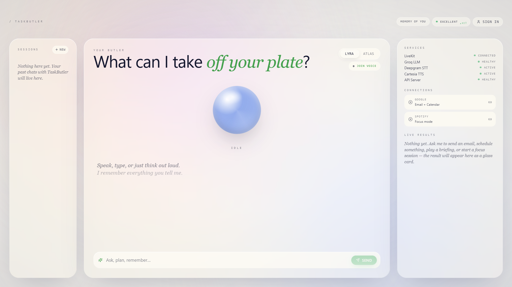

# Task Butler · V2.0

> A voice-first executive assistant that **listens, decides, asks, and acts** — built on a strict Four-Pillar architecture with Human-in-the-Loop safety on every state-changing action.

## 🚀 Live Demo

### Frontend

https://taskbutler-23.web.app

### API Documentation

https://taskbutler-production.up.railway.app/docs

### System Status

* ✅ LiveKit Connected
* ✅ Groq LLM Healthy
* ✅ Deepgram STT Active
* ✅ Cartesia TTS Active
* ✅ MongoDB Atlas Connected
* ✅ Railway Backend Deployed
* ✅ Firebase Frontend Deployed

---

## Dashboard Overview



Task Butler features a voice-first productivity dashboard that combines real-time voice interactions, AI-powered task execution, Gmail integration, Google Calendar automation, Spotify orchestration, and Human-in-the-Loop approval workflows in a single interface.

Speak naturally, type when you have to, and let a LangGraph ReAct agent route your intent to one of four precision-engineered tools — never more, never less. The agent will pause and ask for your approval before it touches your inbox or your calendar, and execute autonomously when you just want focus to begin.

---

## The Four Pillars

Task Butler is deliberately *narrow*. Every legacy generalist tool was pruned so that each pillar can be tested, observed, and trusted in production.

| # | Pillar                                                                                                               | Mode                                                                                     | Powered by                                                     |
| - | -------------------------------------------------------------------------------------------------------------------- | ---------------------------------------------------------------------------------------- | -------------------------------------------------------------- |
| 1 | **`send_email`** — draft and send Gmail messages from a natural-language brief                                       | **HITL** — agent pauses; the UI renders the full email preview with **Approve / Cancel** | Gmail API (OAuth 2.0)                                          |
| 2 | **`add_calendar_event`** — schedule meetings and blocks with timezone-aware parsing                                  | **HITL** — same approval gate before the calendar is written                             | Google Calendar API (OAuth 2.0)                                |
| 3 | **`audio_briefing`** — live news / topic recap, summarised on-the-fly and spoken aloud                               | Autonomous — research → local synthesis → TTS-safe script with clickable citations       | Tavily (research) + a localised Groq summariser + Cartesia TTS |
| 4 | **`environment_orchestrator`** — "deep work mode" in one sentence: book a focus block *and* start the right playlist | Autonomous — two-leg execution with graceful 403/404 handling                            | Google Calendar API + Spotify Web API                          |

---

## Architecture

```text
                ┌────────────────────────────────────────────┐
                │                Next.js 14                  │
                │  • Three-column dashboard (Aura glass UI)  │
                │  • Live tool cards (Framer Motion)         │
                │  • LiveKit duplex audio + text input       │
                └─────────────────────┬──────────────────────┘
                                      │  /api/chat   /api/chat/resume   /api/auth/*
                                      ▼
   ┌──────────────────────────── FastAPI ────────────────────────────┐
   │                                                                 │
   │   ┌──────────────────  LangGraph ReAct Agent  ───────────────┐  │
   │   │   Groq llama-3.1-8b-instant (primary)                    │  │
   │   │   └─→ auto-fallback: llama-3.3-70b-versatile             │  │
   │   │   MemorySaver (shared) · 30-min TTL sweep                │  │
   │   │   Tools: send_email · add_calendar_event ·               │  │
   │   │          audio_briefing · environment_orchestrator       │  │
   │   │   HITL: langgraph.types.interrupt() inside tool bodies   │  │
   │   └─────────────────────────────────────────────────────────┘  │
   │                                                                 │
   │   LiveKit worker (auto-spawned at startup)                      │
   │     STT  : Deepgram                                             │
   │     TTS  : Cartesia (sonic-english)                             │
   │                                                                 │
   │   OAuth vault: MongoDB · Fernet-encrypted                       │
   │     unique (user_id, provider)                                  │
   └─────────────────────────────────────────────────────────────────┘
```

### The Human-in-the-Loop contract

The two pillars that touch the outside world on the user's behalf — **email** and **calendar** — call `langgraph.types.interrupt(...)` from *inside* the tool body. That gives us per-tool gating without restructuring the ReAct graph's single `tools` node, and means the same `MemorySaver` checkpoint can be resumed by either model:

1. The LLM decides to call `send_email` (or `add_calendar_event`).
2. The tool composes the full payload, then **interrupts** the graph — control returns to FastAPI with `interrupted: true`, `tool_name`, and a complete `payload_preview`.
3. The dashboard's right panel renders a glass card with the payload and explicit **Approve** / **Cancel** buttons.
4. The user's choice is `POST`ed to `/api/chat/resume` with `{ approved: true | false }`.
5. The graph resumes from the exact checkpoint — either executing the side-effect or returning a `cancelled` card.

If the model is unavailable or upstream rejects the structured tool call, the request is silently retried with a stronger fallback model on the *same* thread; if that also fails, a guarded parser recovers non-HITL tools from the malformed output. **HITL gates are never bypassed by any recovery path.**

---

## Tech Stack

| Layer           | Choice                                                                 | Why                                                                                                             |
| --------------- | ---------------------------------------------------------------------- | --------------------------------------------------------------------------------------------------------------- |
| Voice transport | **LiveKit** (duplex WebRTC)                                            | Sub-second round-trip, robust to network blips, browser-native.                                                 |
| STT             | **Deepgram**                                                           | Streaming, multilingual, low-latency.                                                                           |
| LLM router      | **Groq · llama-3.1-8b-instant** (+ `llama-3.3-70b-versatile` fallback) | Fast tool-calling on the hot path; the 70b model is a safety net for malformed outputs.                         |
| Tool runtime    | **LangGraph ReAct + MemorySaver**                                      | Native interrupt/resume primitives for HITL; per-thread checkpointing.                                          |
| TTS             | **Cartesia · sonic-english**                                           | Expressive, low-latency, supports voice IDs.                                                                    |
| Backend         | **FastAPI · Python 3.10+**                                             | Async-first, OpenAPI for free.                                                                                  |
| Storage         | **MongoDB**                                                            | Single document store for OAuth credentials (Fernet-encrypted) and conversation memory.                         |
| Frontend        | **Next.js 14 · React 18 · Tailwind CSS · Framer Motion**               | App-router, RSC-friendly, fast iteration; Framer for the entry/exit motion on every tool card.                  |
| Research        | **Tavily**                                                             | Used only by `audio_briefing` to fetch up-to-the-minute context before the local synthesiser writes the script. |

---

## Frontend in 30 seconds

* **Aura** light-glass theme — pearl / sky / peach palette, 14–36 px backdrop blur on every panel.
* Three columns: conversation sidebar / **orb + transcript + input bar** / **live tool feed + OAuth connection chips + system status**.
* Every interactive element carries a `data-testid` for deterministic E2E selectors.
* Tool cards animate in/out via `motion.article` with `layout` and an `AnimatePresence` mode swap; the briefing card has a Framer-driven equalizer, and the orchestrator card spins a vinyl only while playback is actually live.
* The text input and the voice channel share **the exact same** `/api/chat` endpoint — the right-panel UX is identical whether you spoke or typed.

---

## Voice Pipeline (the part you can't see in code)

`User mic → Deepgram (STT) → LiveKit room → FastAPI → LangGraph → Cartesia (TTS) → LiveKit room → User speakers`

The TTS output is rendered on a hidden `<audio playsinline autoplay>` element. When a browser blocks autoplay, the dashboard surfaces a one-click "tap to enable audio" banner that auto-unlocks on the next user gesture.

---

## Reliability

* **Compound unique index `(user_id, provider)`** on `user_oauth_credentials` so Google + Spotify coexist per user.
* **Per-event-loop Mongo client cache** — survives the sync→async re-entry inside tool bodies.
* **30-min HITL idle expiry** on the in-memory checkpointer (env-tunable via `HITL_TTL_SECONDS` / `HITL_SWEEP_INTERVAL`).
* **OAuth callback** propagates Google's actual `error` + `error_description` into the redirect URL, so misconfigured `REDIRECT_URI`s fail loudly instead of silently.
* **Spotify Premium re-link flow** — the OAuth chip in the dashboard force-clears the cached token before opening `/init`, so the upgrade path from Free → Premium just works.

---

## License

MIT.

## Author

Built with ❤️ by Sumit Chillal

### GitHub

https://github.com/sumit-chillal

### Live Links

* Frontend: https://taskbutler-23.web.app
* API Docs: https://taskbutler-production.up.railway.app/docs
